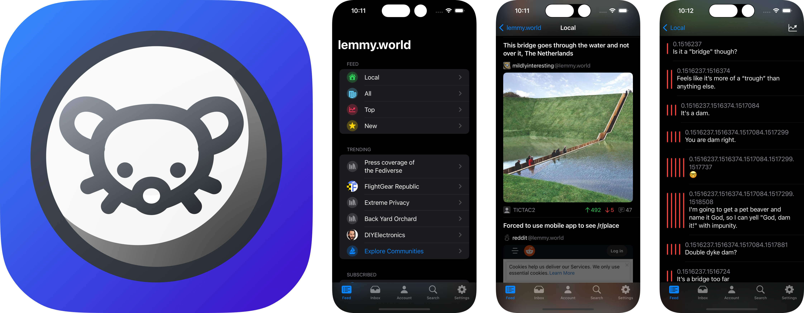

# Lunar - An iOS Client for Lemmy

Lunar is an iOS app that serves as a client for [Lemmy, the open-source federated alternative to Reddit](https://join-lemmy.org/instances)

## Getting Started

Lunar is currently in its alpha testing phase and, as a result, it has not been released on the app store or TestFlight yet. However, you can still install Lunar on your iOS device by following these steps:

1. Ensure you have an Apple developer account. If you don't have one, you can create a free developer account by visiting this link: https://developer.apple.com
   
2. Clone the Lunar repository and open Lunar.xcodeproj.
   
3. In Xcode, select your project, go to the "General" tab, and choose "Automatically manage signing" and your personal team.
   
4. Connect your iPhone to your computer and select it as the run destination.
   
5. Run your project. After a successful build, you might encounter an error in Xcode stating that your app is not from a trustworthy source.
   
6. To resolve this issue, navigate to your device's Settings, search for "Device Management," select your profile name, and then click "Trust."

7. Now, you can run your app again, and it should work without any issues.

## Components

[Alamofire](https://github.com/Alamofire/Alamofire)  - Elegant HTTP Networking in Swift

[Kingfisher](https://github.com/onevcat/Kingfisher) - A lightweight, pure-Swift library for downloading and caching images from the web.

## Contributing

Contributions are welcome! If you would like to contribute, please create a pull request with your changes.

## License

Lunar is released under the [GPL-3.0 license](https://choosealicense.com/licenses/gpl-3.0/). See the `LICENSE` file for more information.

## Contact

If you would like to give feedback or any suggestions, please open a [discussion](https://github.com/mani-sh-reddy/Lunar-Lemmy-iOS/discussions).

