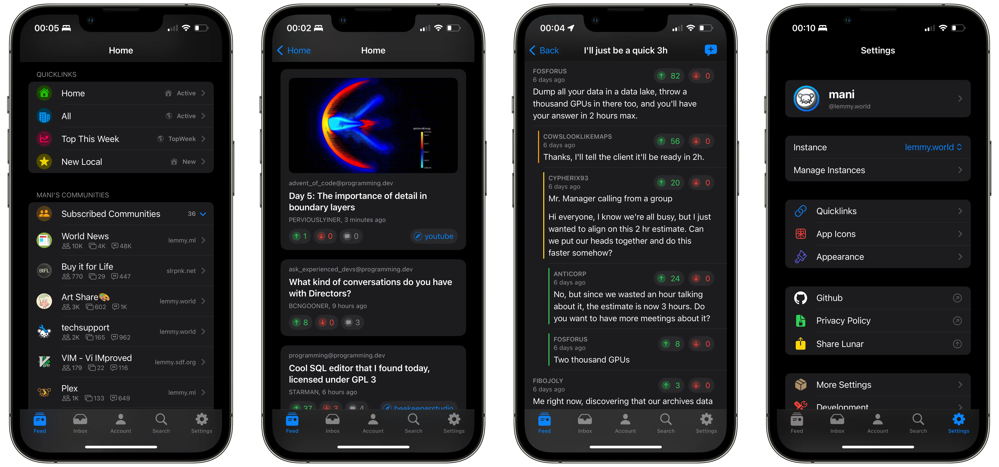

   
# Lunar - An iOS Client for Lemmy and Kbin

Lunar is an iOS app that serves as a client for [Lemmy](https://join-lemmy.org/instances) and [Kbin](https://kbin.pub/en), the open-source federated alternatives to Reddit

_[Full Features Dashboard >](Images/Lunar-Features-Dashboard.webp)_

## Getting Started

**Download Lunar beta on TestFlight - https://testflight.apple.com/join/GEFCCQTb**

## Package Dependencies

The [dependencies.md](DEPENDENCIES.md) file contains the SPM packages used by Lunar.

## Contributing

Contributions are welcome! If you would like to contribute, please [create/choose an issue](https://github.com/mani-sh-reddy/Lunar/issues) and raise a pull request when done.

This repo uses [DeepSource](https://deepsource.com) for linting and formatting, and is automatically triggered and run on a PR.

## License

Lunar is released under the [GPL-3.0 license](https://choosealicense.com/licenses/gpl-3.0/). See the `LICENSE` file for more information.

## Contact

If you would like to give feedback or any suggestions, please [open a discussion](https://github.com/mani-sh-reddy/Lunar/discussions), [create a post on lemmy](https://lemmy.world/c/lunar), or [email me](mailto:lunarforlemmy@outlook.com).
