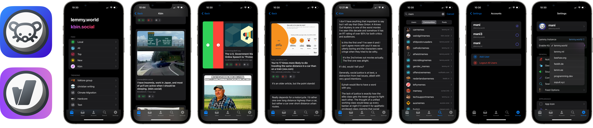

   
# Lunar - An iOS Client for Lemmy and Kbin

Lunar is an iOS app that serves as a client for [Lemmy](https://join-lemmy.org/instances) and [Kbin](https://kbin.pub/en), the open-source federated alternatives to Reddit

## Getting Started

**Lunar is now on [TestFlight](https://testflight.apple.com/join/GEFCCQTb)!**

## Package Dependencies

[Alamofire](https://github.com/Alamofire/Alamofire)  - Elegant HTTP Networking in Swift

[Kingfisher](https://github.com/onevcat/Kingfisher) - A lightweight, pure-Swift library for downloading and caching images from the web.

[SwiftSoup](https://github.com/scinfu/SwiftSoup) - Pure Swift HTML Parser

[Nuke](https://github.com/kean/Nuke) - Image loading system

## Contributing

Contributions are welcome! If you would like to contribute, please [create/choose an issue](https://github.com/mani-sh-reddy/Lunar/issues) and raise a pull request when done.

This repo uses [DeepSource](https://deepsource.com) for linting and formatting, and is automatically triggered and run on a PR.

## License

Lunar is released under the [GPL-3.0 license](https://choosealicense.com/licenses/gpl-3.0/). See the `LICENSE` file for more information.

## Contact

If you would like to give feedback or any suggestions, please open a [discussion](https://github.com/mani-sh-reddy/Lunar-Lemmy-iOS/discussions).

